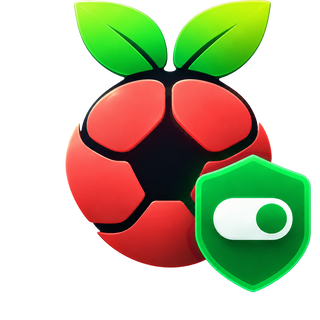

<p align="center">
  
</p>

<h1 align="center">Pi-hole Browser Extension</h1>


An unofficial browser extension for controlling Pi-hole directly from Firefox and Chromium-based browsers. The current version targets **Pi-hole v6 and later** and provides both global and client-group-specific controls.

## Further Development of the Original Project

This project is a continuation of the original [Pi-hole Browser Extension by Pascal Glaser](https://github.com/badsgahhl/pihole-browser-extension).

Unfortunately, this great project is now in maintenance mode. Since I use the extension extensively myself, I have added numerous features, modernized it, and adapted it to my needs.

This fork is actively maintained.

## Features

### Pi-hole and domain controls

- Enable or disable filtering on the configured Pi-hole instances.
- See whether the current domain is blocked globally.
- Add the current domain to the global whitelist or blacklist.
- Configure one or more Pi-hole connections.
- Optionally reload the current tab after disabling filtering or whitelisting a domain.

### Client-group actions

- Select a Pi-hole client group directly in the popup.
- See whether the current domain is blocked for the selected group.
- Assign whitelist or blacklist rules specifically to the selected group.
- Temporarily whitelist the current domain for configurable durations.
- Enable, disable or temporarily pause filtering for the selected group.
- Use the selected group's domain status for the toolbar icon.

### Customization and shortcuts

- Show active, blocked, temporarily allowed, disabled and error/unknown states directly through the toolbar icon.
- Configure the three presets used for temporary domain whitelisting and group pauses.
- Hide the client-group selector or individual action sections from the popup.
- Use keyboard shortcuts and browser context-menu actions.
- Check saved Pi-hole connections from the settings page.
- Follow the browser's light or dark appearance.

## Requirements

- Pi-hole v6 or later.
- Firefox or a Chromium-based browser.
- Network access from the browser to the configured Pi-hole address.
- A valid Pi-hole web-interface password when authentication is enabled.

## Setup

1. Open the extension popup and select the cog button.
2. Enter the complete Pi-hole address, including `http://` or `https://` and any required path.
3. Enter the Pi-hole web-interface password.
4. Save the connection and verify it with the connection check.
5. Optionally select a default client group and customize the popup, toolbar icon and timer presets.

Multiple Pi-hole instances are supported, but combined behavior can vary with the network and Pi-hole configuration. Test the intended actions before relying on a multi-instance setup.

## Privacy and permissions

Pi-hole addresses, passwords and extension preferences are stored in the browser's local extension storage. They are not placed in browser synchronization storage.

The extension requires access to HTTP and HTTPS addresses so it can communicate with user-configured Pi-hole instances, including devices hosted on local network addresses. Access to the active tab is used to identify the current domain for status checks and list actions. Context-menu and alarm permissions support the corresponding shortcuts and temporary actions.

## Development

The project uses Vue, TypeScript, Vuetify, Webpack and npm. Node.js versions 22 through 24 are supported. The committed `package-lock.json` is the source of truth for dependency installation.

```bash
npm ci --prefer-offline --no-audit --no-fund
npm run check
```

Useful commands:

```bash
npm test
npm run typecheck
npm run lint
npm run format:check
npm run build
npm run build:firefox
npm run build:chrome
npm run package:artifacts
```

`npm run check` performs the same source, test, browser-build, Firefox-lint and package-structure checks used by CI. Production builds are written to `dist/`. Validated ZIP/XPI packages and SHA-256 checksums are written to `artifacts/` by `npm run package:artifacts`.

## Releases

Stable release tags must match the exact version in `package.json`, `manifest.firefox.json` and `manifest.chrome.json`, for example `v4.2.0`. Release candidates append a prerelease suffix to the same base version, for example `v4.2.0-rc.11`.

The release workflow validates the source from a clean checkout, builds separate Firefox and Chrome packages, creates a source archive containing `SOURCE_COMMIT.txt`, generates SHA-256 checksums and refuses to overwrite an existing GitHub release. Tags with a prerelease suffix are published as prereleases.

## Troubleshooting

### A switch or action reports an error

Check the saved Pi-hole address and password for whitespace or an incorrect path, then run the connection check from the settings page. The browser must be able to reach the Pi-hole address directly.

### Domain status is unknown

A status can only be determined when the current page has a usable domain, the Pi-hole connection succeeds and the required lists or group assignments can be read. Internal browser pages do not expose a normal web domain.

### Group actions are unavailable

Save and verify a working Pi-hole v6 connection first. The selected client group must exist on every Pi-hole instance involved in the action.

## Contributors

- [Pascal Glaser](https://github.com/badsgahhl)
- [Erik Rill](https://github.com/erikr729)
- [HyperCriSiS](https://github.com/HyperCriSiS)

## License

This project is available under the [MIT License](LICENSE).

## Disclaimer

This is not an official Pi-hole application. Report extension problems in this repository; the Pi-hole project is not responsible for malfunctions caused by this extension.
